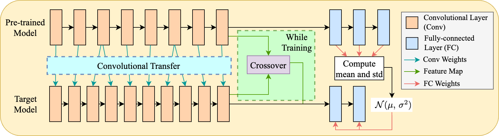

# Transfer Learning using Variance-based mapping and Feature crossover
[](https://www.python.org)

This is the official implementation of paper: TLV

Knowledge from the pretrained model is transferred to the target model in the form of weight at convolution layers and in the form of
cumulative statistics to initialize weight for linear layers. Finally, a feature crossover strategy is utilized to improve the performance of target model during training.



## Installation
```bash
pip install -r requirements.txt
```
## Usage
```python
from torchvision import models as torchmodel
from models import CustomResnet
from toolkit import TLVFC
from toolkit.standardization import FlattenStandardization
from toolkit.matching import IndexMatching
from toolkit.transfer import VarTransfer


# initialize the TLV transfer tool
transfer_tool = TLVFC(
    standardization=FlattenStandardization(),
    matching=IndexMatching(),
    transfer=VarTransfer()
)  

# define a pre-trained model and load the checkpoint weight from the torchvision hub
pretrained_model:nn.Module = torchmodel.vgg16(weigths = torchmodel.VGG16_Weights.IMAGENET1K_V1)

# define the target model, which is enclosed in a new training mechanism.
target_model = CustomResnet._get_model_custom(model_base='resnet18', num_classes=100)

# start to transfer knowledge
transfer_tool(
    from_module=pretrained_model,
    to_module=target_model
)

# training the target model with knowledge is transferred
train(target_model)
```

## Experiemental results

We present the performance evaluation of our proposed method, TLV (Transfer Learning with Variance-based Regularization), along with comparisons to other methods on four different datasets: CIFAR-10, CIFAR-100, Food-101, and PetImages. The benchmarking is conducted using ResNet18 as the target model and VGG16 pretrained with ImageNet1K weights as the source model for the transfer process.

| Method   | CIFAR10 | CIFAR100 | Food-101 | PetImages |
|----------|---------|----------|----------|-----------|
| He initialization | 0.7635 | 0.4178 | 0.675 | 0.9481 |
| DPIAT     | 0.7695 | 0.4155 | 0.6806 | 0.9498 |
| TLV-base  | 0.7677 | 0.4234 | 0.7038 | 0.9669 |
| TLV-cross | 0.7674 | 0.4293 | **0.7043** | 0.9686 |
| TLV      | **0.7724** | **0.4294** | 0.7025 | **0.9696** |

